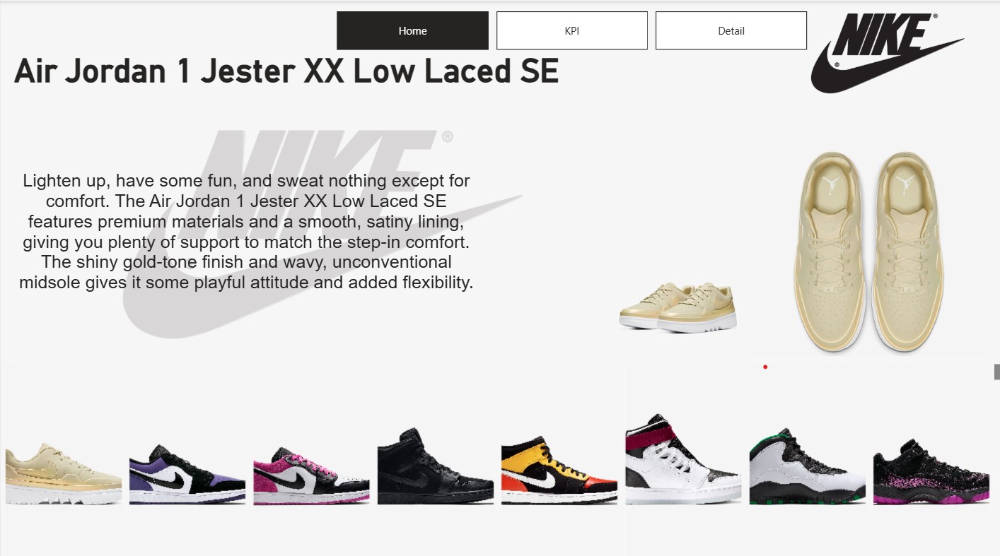

# 🛍️ NIKE-Sales-Dashboard

## 📌 Overview
Just wrapped up a new Power BI project! 📊 I created an interactive dashboard to analyze the sales performance of the Nike shoes

## 📊 Dashboard Preview

## 🧰 Tools Used
- Power BI
- Excel

## 📁 Files
- "Nike US Sales Datasets (1) - Data Sales Nike" – Raw dataset
- `NIKE SALES DASHBOARD` – Power BI dashboard
- `nike_2020_04_13 - nike_2020_04_13`– Raw dataset

## 🔍 Insights
This dashboard provides a comprehensive overview of the shoe's performance, highlighting key metrics like:
Operating Profit, Units Sold, Regional Performance, Monthly Sales Trends etc.
